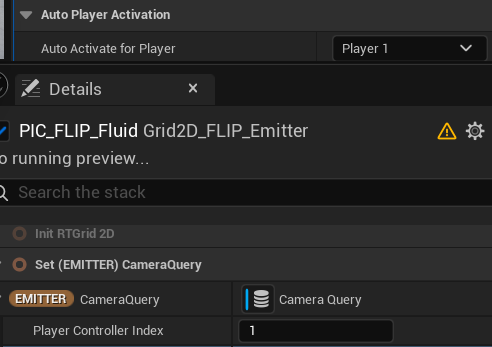

# Session #9
**Date:** 2026-01-22 | **Start:** 16:29 | **End:** 18:45 | **Duration:** 2h 16m

## Goals
- [x] Investigate Camera and particle Facing correlation
- [ ] Tune parameters for better waterfall effect
- [ ] Research ways to move driving particles
- [ ] Research transparent object interaction with waterfall

## Plan
- Investigate Niagara camera-facing behavior
- Set up clipboard screenshot capture for devlog

## Progress (In Session)

### Camera-Facing Investigation
**Finding:** Camera and particle facing correlation comes from Niagara internal node graph

**Temporary Solution:**
1. Place a Camera Actor, set `Auto Activate for Player` = `Player 1`
2. In Niagara's CameraQuery module, set `Player Controller Index` = `1`
3. Set `Require Current Frame Data` = `false`

### Clipboard Screenshot Setup
- Installed `mcp-windows-clipboard` MCP server from GitHub
- Created PowerShell script (`save_clipboard.ps1`) for clipboard image capture
- Configured devlog to auto-save screenshots to `devlog/media/YYYY-MM-DD/`
- Screenshots embedded inline in Progress section (not separate Screenshots section)
- Updated all devlogger documentation with new workflow
- Pushed updates to claude-devlogger remote repository

## Problems & Solutions

### VS Code Markdown Preview Not Showing Images
**Problem:** Relative path images not rendering in VS Code preview
**Solution:** Use absolute `file:///` path or open VS Code from the correct workspace root (`claude-devlogger` folder)

## Milestones
- [x] Camera-facing workaround found
- [x] Screenshot capture system configured
- [x] Devlogger documentation updated and pushed

## To-Do (Next Session)
- [ ] Tune parameters for better waterfall effect
- [ ] Research ways to move driving particles
- [ ] Research transparent object interaction with waterfall
- [ ] Add troubleshooting section to devlogger docs

## Conclusion
Focused session on tooling improvements. Found a temporary workaround for the camera-facing issue in Niagara. Major achievement was implementing a full clipboard-to-devlog screenshot pipeline using MCP, enabling inline image embedding in session logs. Three Niagara research goals carried over to next session.
